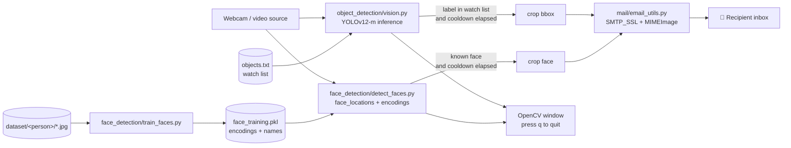

# MultiVision

**Real-time webcam surveillance with YOLO object detection, face recognition and automatic email alerts with snapshots.**

MultiVision watches a camera feed, draws live detections, and **emails you a cropped picture** when it sees something you care about, such as a specific object class or a known person. A per-label cooldown prevents alert spam.

---

## Features

- **Object detection:** Ultralytics **YOLOv12-m** on each frame, with boxes and labels for detections above 0.5 confidence.
- **Watch-list alerts:** any class listed in `object_detection/objects.txt` (for example `person`, `cell phone`) triggers an email with the cropped object.
- **Face recognition:** train on a folder of photos per person, then recognise them live using `face_recognition` (dlib) encodings at tolerance 0.6.
- **Email notifications:** Gmail over SMTP SSL with the snapshot attached as a JPEG.
- **Cooldown:** at most one email per label or person every 180 s.

## Architecture



| Module | Responsibility |
|---|---|
| `multi_vision.py` | Entry point. Runs object detection by default. Also exposes `train_model` and `recognize_faces`. |
| `object_detection/vision.py` | Video loop, YOLO inference, drawing, and the watch-list and cooldown logic. |
| `face_detection/train_faces.py` | Encodes one face per training image and pickles the encodings and names. |
| `face_detection/detect_faces.py` | Live recognition against the trained encodings. |
| `mail/email_utils.py` | Builds and sends the alert email with the attached crop. |

## Getting started

```bash
git clone https://github.com/nakultt/MultiVision.git
cd MultiVision
pip install ultralytics opencv-python face_recognition python-dotenv
```

Create a `.env` file:

```env
SENDER_EMAIL=you@gmail.com
SENDER_PASSWORD=your-gmail-app-password
RECIPIENT_EMAIL=alerts@example.com
```

Place the YOLO weights at `object_detection/yolo12m.pt`. Ultralytics can download `yolo12m.pt` for you.

```bash
python multi_vision.py                 # object detection + alerts
```

**Face recognition:**

```bash
# dataset layout: face_detection/dataset/<person_name>/*.jpg
python -c "from face_detection.train_faces import train_model; train_model()"
python -c "from face_detection.detect_faces import recognize_faces; recognize_faces()"
```

Edit `object_detection/objects.txt` (one COCO class name per line) to change which objects trigger alerts.

## Tech stack

Python · Ultralytics YOLO · OpenCV · face_recognition (dlib) · smtplib · python-dotenv

## License

See [LICENSE](LICENSE).
